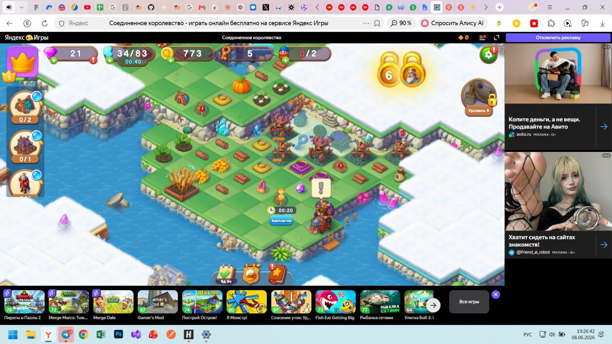

# BUG-001: Восклицательный знак у Lord отображается без доступного действия

**Type:** UX / misleading notification  
**Priority:** Medium  
**Environment:** Windows 11

## Preconditions

- открыта основная карта;
- иконка Lord доступна;
- внутри раздела нет действия, которое игрок может выполнить прямо сейчас.

## Steps

1. Открыть игру.
2. Дождаться загрузки карты.
3. Обратить внимание на иконку Lord слева.
4. Открыть раздел Lord.
5. Проверить доступные действия.

## Actual result

На иконке отображается восклицательный знак, но после открытия раздела нет полезного доступного действия.

## Expected result

Индикатор должен появляться только при наличии действия, которое игрок действительно может выполнить: получить награду, совершить обмен или открыть новое задание.

## Impact

Ложное уведомление заставляет игрока совершать лишние переходы и снижает доверие к системе индикаторов.

## Evidence

