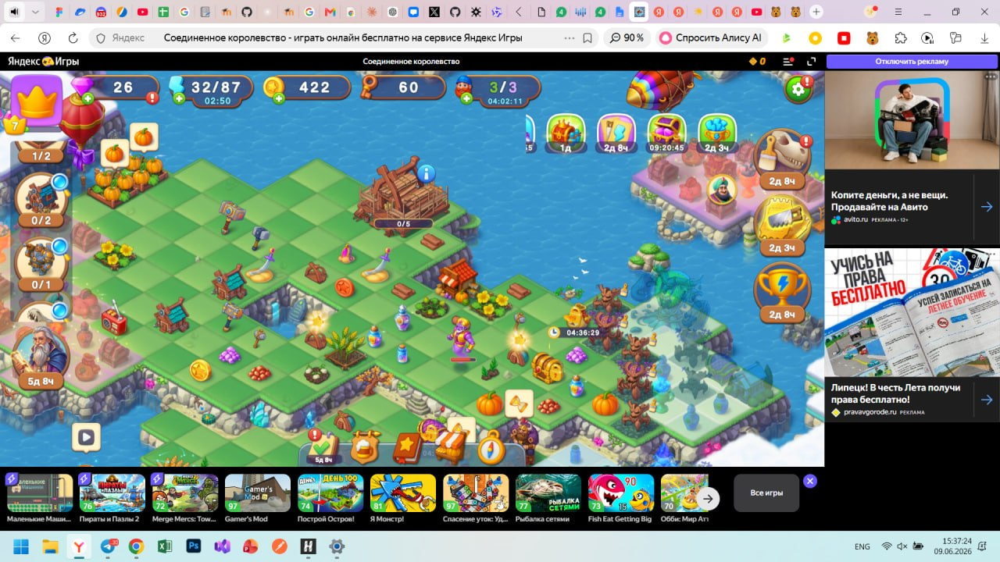

# BUG-002: Панель предложений и событий обрезана справа

## Классификация

- **Тип:** UI / usability issue
- **Severity:** Minor–Major в зависимости от доступности скрытых событий
- **Priority:** Medium — указано в исходном задании
- **Окружение:** Windows 11; браузер, разрешение и масштаб не зафиксированы

## Предусловия

1. Открыта браузерная версия игры.
2. Справа отображается внешняя рекламная панель.
3. Активно несколько событий или предложений.

## Шаги

1. Открыть игру и дождаться загрузки карты.
2. Посмотреть на правый верхний угол игрового интерфейса.
3. Проверить видимость всех иконок событий и предложений.
4. Попытаться открыть полный список.

## Фактический результат

Часть панели визуально прижата к правому краю или обрезана. Очевидный способ открыть полный список отсутствует.

## Ожидаемый результат

Все активные события доступны пользователю. При нехватке места интерфейс предоставляет прокрутку, стрелку, кнопку «Все события» или отдельное окно.

## Влияние

- игрок может не заметить активное событие;
- может быть пропущена ограниченная по времени награда;
- интерфейс выглядит незавершённым;
- возможны потери вовлечённости и монетизации.

## Доказательство

## Что нужно уточнить

- поддерживаемое разрешение;
- масштаб браузера;
- должно ли горизонтальное переполнение прокручиваться;
- влияет ли боковая рекламная панель;
- воспроизводится ли в полноэкранном режиме;
- доступны ли скрытые элементы через клавиатуру или hover.

## Рекомендация

Добавить адаптивное размещение панели и явный способ открыть все события. В регрессию включить комбинации разрешения, масштаба, количества иконок и наличия боковой рекламы.
